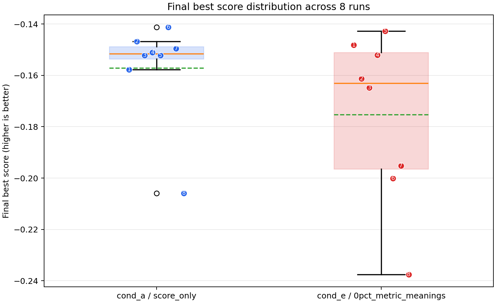
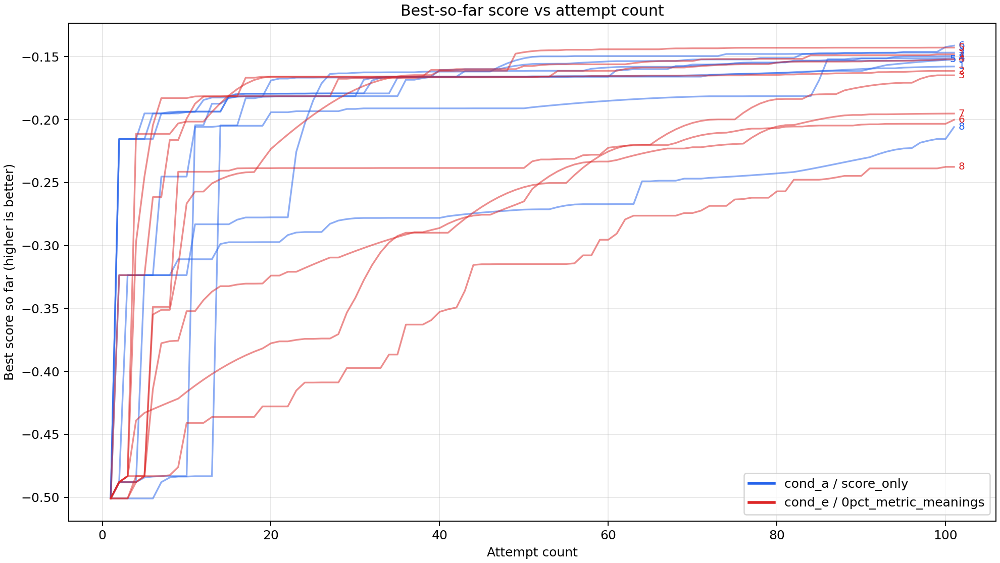
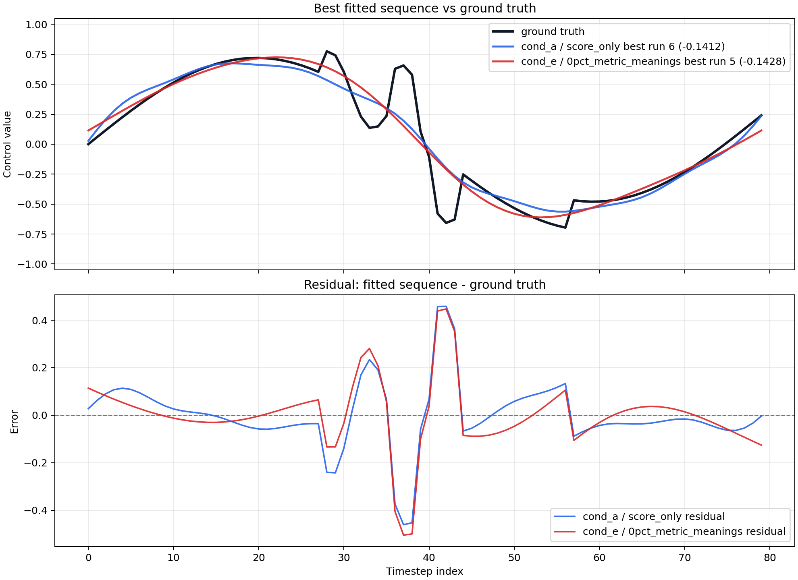
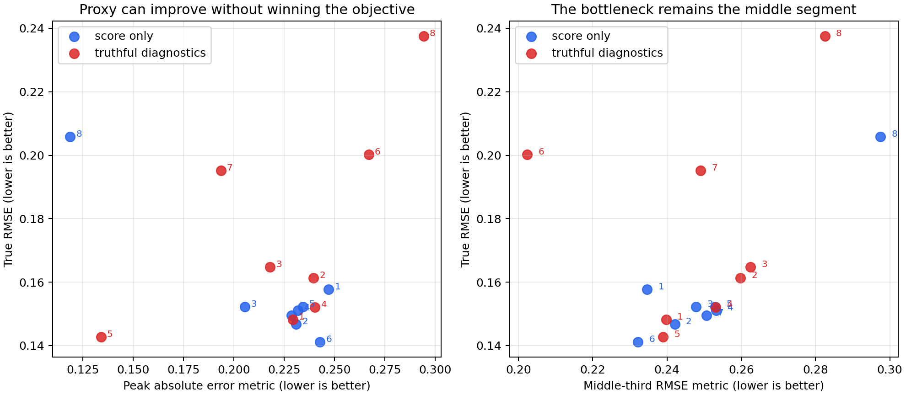
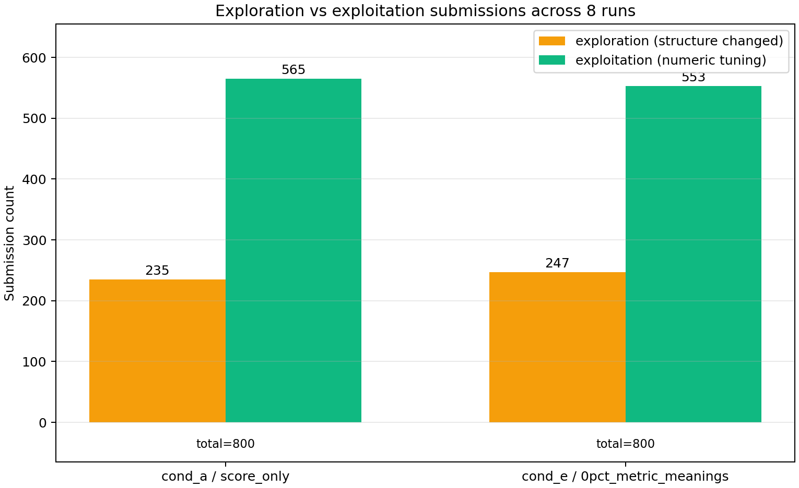

# Is Feedback in Algorithm Evolution a Free Lunch?

*More diagnostics can make an agent better at explaining its errors while making it worse at finding the optimum.*

Feedback is the obvious thing to add to an algorithm discovery loop. If a coding agent proposes an algorithm, runs an evaluator, and receives only a scalar score, the search feels unnecessarily blind. Why not also tell the agent which part of the solution failed? Why not return diagnostics, region-wise errors, constraint violations, or a richer rubric? In most engineering settings, this seems like free information.

The experiment below is a small counterexample to that intuition.

In an agentic algorithm evolution task, I compared two conditions. In `cond_a`, the agent only saw the objective score. In `cond_e`, the agent saw the same objective score plus five truthful diagnostic metrics, with their meanings explicitly disclosed. The diagnostics were not noisy. They were not adversarially mislabeled. They were computed directly against the hidden target.

Yet the metric-disclosure condition did worse on average.

The lesson is not that feedback is bad. The sharper lesson is that feedback is not just information. Feedback is an intervention on the search policy. A coding agent does not passively absorb diagnostics as Bayesian evidence. It reads them, explains them, builds an implicit proxy objective, and uses that proxy to decide what code to mutate next. If the diagnostic view is truthful but partial, local, and not decision-sufficient, the resulting proxy can become a Goodhart target: the visible metric improves, while the true evaluator score stagnates or worsens.

This post walks through the theory, the experimental setup, the empirical result, and the agent traces that make the mechanism visible.

## The Claim

The core claim is:

> In agentic algorithm discovery, truthful feedback can harm optimization when the feedback induces an attractive but incomplete proxy objective.

This is distinct from the usual story about bad feedback. The usual failure modes are easy to name: noisy metrics, misleading labels, reward bugs, hidden confounders, data leakage, or a learned reward model that can be hacked. Those are real. But this experiment isolates a more uncomfortable case.

The diagnostics in `cond_e` were true. The agent was told what they meant. They measured real errors against the hidden reference waveform. The problem was that they were lossy projections of the objective. They exposed some slices of the error surface, but not the full decision problem of which program family to search next.

A scalar objective asks: "Which candidate has the best total score?"

A diagnostic vector tempts the agent to ask: "Which visible metric should I fix next?"

Those questions are not equivalent.

## Background: Feedback as a Search Prior

Most LLM-based algorithm discovery systems follow a simple loop:

1. Generate candidate code.
2. Execute it against an evaluator.
3. Archive the score and artifacts.
4. Ask the agent to improve the next candidate.

This pattern appears in systems such as FunSearch, AlphaEvolve, Eureka, LLaMEA-style evolutionary algorithm design, and many coding-agent workflows. The evaluator is not merely a judge at the end of the process. It shapes the next prompt, the agent's hypotheses, and the mutation operators it chooses.

So the feedback channel has two roles:

- **Measurement**: report how good the candidate was.
- **Control**: influence what the agent tries next.

The second role is where trouble starts. Once feedback becomes an input to the next generation policy, diagnostic metrics become affordances. They suggest decompositions, causal stories, and local edits. A truthful metric can still be the wrong handle.

Goodhart's law is usually summarized as: when a measure becomes a target, it ceases to be a good measure. In this setting, the phrase needs a small update:

> When a diagnostic becomes a search target, it can cease to be a reliable guide to the evaluator.

The diagnostic does not have to become false. It only has to become overused.

## Experimental Setup

The experiment lives in the Control Sequence task under this repository:

- Task directory: [`examples/Control_Sequence`](.)
- Score-only prompt: [`problem.md`](problem.md)
- Metric-disclosure prompt: [`problem_cond_e.md`](problem_cond_e.md)
- Private evaluator: [`evaluator_core.py`](evaluator_core.py)
- Score-only config: [`config_score_only.yaml`](config_score_only.yaml)
- Metric-disclosure config: [`config_0pct_metric_meanings.yaml`](config_0pct_metric_meanings.yaml)

The agent must implement:

```python
def generate_control_sequence(n: int = 80) -> list[float]:
    ...
```

The generated list must match a hidden 80-point reference waveform. The scalar score is negative RMSE, so higher is better and 0 is optimal.

Two conditions are the focus here:

| Condition | Internal label | Feedback visible to agent |
| --- | --- | --- |
| `cond_a` | `score_only` | Scalar score only |
| `cond_e` | `0pct_metric_meanings` | Scalar score plus five truthful diagnostics with meanings disclosed |

The `cond_e` prompt disclosed the five metrics as:

| Metric | Meaning |
| --- | --- |
| `metric_01` | Mean signed error over all 80 timesteps, `sequence - target`; closer to 0 is better |
| `metric_02` | RMSE on the middle third of the sequence |
| `metric_03` | RMSE on the final third of the sequence |
| `metric_04` | Maximum absolute error on the five largest-magnitude target points |
| `metric_05` | RMSE on the first third of the sequence |

These are all truthful metrics. The private evaluator computes them directly from the hidden target and the submitted sequence.

The hidden target was deliberately chosen to make the aggregate diagnostics incomplete. It is mostly a sine wave, but with three localized structures:

```python
base = 0.72 * sin(2*pi*t)
step = 0.24 if t > 0.72 else 0.0
local_oscillation = 0.22 * sin(18*pi*t) if 0.35 < t < 0.55 else 0.0
paired_pulse = +0.30 if 0.455 < t < 0.49 else -0.30 if 0.51 < t < 0.545 else 0.0
```

The paired positive and negative pulses are especially important. They create local error that can cancel in the mean. The middle-third RMSE sees some of it, but only coarsely. The peak metric sees only the five largest-magnitude target points, which are not necessarily the points that reveal the full local structure. This makes the diagnostics factual but partial.

Each condition ran 8 independent replicates with 100 submissions each, for 800 submissions per condition.

## Result 1: Truthful Diagnostics Performed Worse on Average

The final best scores across 8 runs were:

| Condition | Mean final score | Standard deviation | Best run | Worst run |
| --- | ---: | ---: | ---: | ---: |
| `cond_a` score only | -0.157078 | 0.018978 | -0.141205 | -0.205882 |
| `cond_e` truthful diagnostics | -0.175259 | 0.030668 | -0.142792 | -0.237544 |

Because score is `-RMSE`, less negative is better. The metric-disclosure condition was worse by `0.01818` score units on average, with a simple Cohen's d of about `-0.67` for `cond_e - cond_a`. With only 8 runs per condition, this is evidence for a failure mode rather than a universal law. But it is enough to falsify the naive "truthful feedback is free information" story.



**Figure 1. Final best score distributions.** The score-only condition has the better mean and the tighter distribution. The truthful-diagnostic condition can still find a competitive best run, but it has a worse tail.

The learning curves show the same pattern. `cond_e` starts slightly ahead at 10 attempts, but falls behind through the middle of the budget:

| Attempt cutoff | `cond_a` mean best-so-far | `cond_e` mean best-so-far |
| ---: | ---: | ---: |
| 10 | -0.303505 | -0.287660 |
| 25 | -0.194428 | -0.255776 |
| 50 | -0.178662 | -0.213485 |
| 75 | -0.170630 | -0.188473 |
| 100 | -0.158481 | -0.175659 |

That shape matters. It suggests that the diagnostic condition is not simply slower because it lacks information. It initially uses the extra information, but then spends much of the search budget following locally coherent refinements that do not close the global gap.



**Figure 2. Best-so-far trajectories.** Each line is a replicate. The metric-disclosure runs have more bad tails even though their feedback is richer.

## Result 2: Both Best Programs Miss the Same Hidden Structure

The best run in each condition learned the broad sine-like envelope. Neither condition fully discovered the localized middle structure.



**Figure 3. Best fitted sequences versus ground truth.** Both best candidates fit the global waveform but miss the localized middle oscillation and paired pulse structure. The residual plot shows where the objective remains hard.

The best programs had these true signal metrics:

| Best run | RMSE | Early RMSE | Middle RMSE | Late RMSE | Mean signed error | Peak abs error |
| --- | ---: | ---: | ---: | ---: | ---: | ---: |
| `cond_a` run 6 | 0.141205 | 0.059070 | 0.232178 | 0.060595 | 0.000265 | 0.242760 |
| `cond_e` run 5 | 0.142792 | 0.043877 | 0.238959 | 0.058693 | -0.000014 | 0.133960 |

This table is the crux. The metric-disclosure agent did something real: its best run made the peak-error metric much better, `0.133960` versus `0.242760`. But the global RMSE did not improve. In fact, it was slightly worse than the best score-only run. A visible diagnostic improved while the true objective did not.

That is a small Goodhart-style failure.



**Figure 4. Proxy metric mismatch.** The left panel shows that improving the peak-error proxy is not sufficient to win the true RMSE objective. The right panel shows that the middle-third error remains the bottleneck.

## Result 3: The Agent Actually Used the Diagnostics as a Proxy

The most important evidence is not just the aggregate score. The agent traces show how the diagnostics entered the search policy.

In `cond_e` run 5, the agent explicitly described using the disclosed metrics to infer the hidden target and guide parameter tuning:

> "Probed target statistics by submitting constant sequences ... and using the per-third RMSE metrics to derive per-third means and stds: first third mean≈0.502, middle≈0.044, final≈-0.313."

It then summarized its own strategy as:

> "Refined iteratively over 100 submissions, using `metric_01`-`metric_05` to guide parameter adjustments."

The same run ended with diagnostics that look locally excellent on some axes:

```text
metric_01≈0.0, metric_02=0.239, metric_03=0.059, metric_04=0.134, metric_05=0.044
```

Those diagnostics tell a plausible success story: mean error solved, late segment solved, first segment solved, peak error much improved. Yet the run still missed the hidden middle structure and finished only slightly behind the best score-only run.

In `cond_e` run 7, the agent wrote an even cleaner example of metric-driven tradeoff reasoning:

> "The middle and final thirds have much higher error than the first third. Adding a 4th sine component at higher frequency could help reduce those errors."

Then it swept a parameter and described the outcome as:

> "Each increase monotonically improved the score by reducing m2 (middle third RMSE: 0.251→0.249) and m3 (final third RMSE: 0.221→0.218), at the cost of slightly increasing m4 (max error on 5 largest points: 0.170→0.194) and m5 (first third RMSE: 0.052→0.065)."

This is not vague speculation about the model's hidden thoughts. The agent told us what it was doing. It was forming a local proxy objective over the visible diagnostics and trading them off.

For contrast, a strong `cond_a` score-only run described a more black-box reconstruction process:

> "Score trajectory: 0.501 → 0.215 (sine) → 0.160 (sine+linear) → 0.148 (+3rd harmonic) → 0.146 (+5th) → 0.141 (+7th)."

There is still interpretation here, of course. A score-only agent is not free from inductive bias. But it did not have a named vector of region-specific metrics inviting local decomposition. It mainly followed score-improving program families.

A crude keyword count in the logs matches this qualitative picture:

| Term | `cond_a` logs | `cond_e` logs |
| --- | ---: | ---: |
| `metric_` | 0 | 7121 |
| `middle` | 0 | 8 |
| `final third` | 0 | 7 |
| `first third` | 0 | 6 |
| `peak` | 0 | 2 |
| `RMSE` | 1433 | 1451 |
| `score` | 1441 | 2262 |

The `metric_` count is inflated by JSON feedback dumps, so it should not be overinterpreted. The stronger evidence is the agent's own strategy summaries. But the broad pattern is clear: `cond_e` made the metric vector a central object in the search loop.

## Result 4: Diagnostics Did Not Simply Increase Exploration

One possible explanation is that feedback changed the exploration-exploitation balance. I classified each submitted program by comparing its AST structure to the previous submission. If the structure changed after replacing numeric constants with placeholders, I counted it as exploration. If the structure stayed the same and only constants changed, I counted it as exploitation.

The totals were:

| Condition | Submissions | Exploration | Exploitation | Exploration rate |
| --- | ---: | ---: | ---: | ---: |
| `cond_a` score only | 800 | 235 | 565 | 29.4% |
| `cond_e` truthful diagnostics | 800 | 247 | 553 | 30.9% |



**Figure 5. Exploration versus exploitation.** Truthful diagnostics did not dramatically increase structural exploration. The failure mode is better described as metric-shaped search than as a simple loss of exploration.

This classification is imperfect. Adding one sine term and rewriting the whole function both count as structural exploration. A parameter-only edit can still be behaviorally large. But the aggregate is useful: `cond_e` was not obviously trapped because it never explored. It explored slightly more. The issue was what its exploration was organized around.

The traces suggest a useful phrase: **semantic exploitation disguised as exploration**. The agent may add a new harmonic, a new offset, or a new local term, but the reason for the change is still anchored to the same metric decomposition: reduce middle RMSE, protect peak error, keep mean error near zero.

## Mechanism: From Truthful Diagnostics to Proxy Objective

The failure mechanism can be summarized as a four-step loop:

1. The evaluator reports a truthful but partial diagnostic vector.
2. The agent interprets that vector as a decomposition of the task.
3. The agent constructs an implicit proxy objective over visible metrics.
4. The evolution loop optimizes code against that proxy, not directly against the full hidden structure.

The key is step 3. The proxy is rarely written down. It emerges in the agent's decisions: what to test, what to preserve, what to mutate, and which result to explain as progress.

In this task, the proxy was seductive because each metric sounded actionable:

- Mean signed error suggests offset correction.
- First/middle/final RMSE suggests segment-wise fitting.
- Peak absolute error suggests amplitude and phase tuning near large target values.

Those are reasonable handles. But the true target included localized oscillations and paired pulses. The best way to improve score was not necessarily to solve the named diagnostics one by one. The agent needed to discover a better structural hypothesis about the hidden waveform.

A score-only agent can also get stuck. But it has fewer named local handles to overfit. It must keep asking the blunt evolutionary question: did the total score improve?

## Why Truthfulness Was Not Enough

It is tempting to think that the fix is simply to make diagnostics accurate. This experiment suggests a stricter requirement.

A diagnostic should be:

1. **Truthful**: it measures what it claims to measure.
2. **Relevant**: it correlates with the true objective.
3. **Decision-sufficient**: optimizing it locally tends to improve the actual next-step search decision.

The `cond_e` metrics satisfy the first property. They partially satisfy the second. They fail the third.

The middle-third RMSE was relevant, but too coarse to reveal the paired pulse. Mean signed error was truthful, but easy to solve by cancellation. Peak error was actionable, but not the bottleneck. Segment metrics told the agent where the loss was, not what program family would repair it.

That distinction is central. Diagnostics can be accurate descriptions and poor interventions at the same time.

## Relation to Prior Work

This result sits at the intersection of Goodhart's law, reward hacking, reflection-based agents, and LLM-driven algorithm discovery.

Goodhart and Campbell warned that measures become unreliable when used for control. Manheim and Garrabrant later categorized Goodhart variants, including regressional, extremal, causal, and adversarial forms. The present experiment is closest to a proxy-objective version: the visible diagnostic vector is not the true objective, but it becomes an optimization target inside the agent's policy.

The reward hacking and specification gaming literature gives many examples where agents exploit flawed rewards. This experiment is narrower: the diagnostics are not flawed in the sense of being false. The failure comes from partial observability and agent interpretation.

Reflection and self-improvement work such as Reflexion and Self-Refine shows that natural-language feedback can improve agents. Textual-gradient and prompt-optimization work such as ProTeGi and TextGrad goes further, treating feedback as a kind of semantic gradient. This experiment does not contradict that line. It adds a caution: a semantic gradient can point in a locally meaningful but globally insufficient direction.

FunSearch, AlphaEvolve, Eureka, and related LLM-based evolution systems demonstrate the power of pairing generative models with automated evaluators. The lesson here is that richer evaluator outputs should be treated as part of the search algorithm, not as passive logs. Changing feedback changes the mutation distribution.

Recent rubric and verifier work makes the same issue more urgent. Rubrics, judges, and contextual verifiers can expose rich criteria to agents. That may help, but it also creates new proxy objectives. A rubric is not just a measurement device. It is a steering wheel.

## What This Means for Algorithm Evolution Systems

The practical takeaway is not "hide feedback." The takeaway is to evaluate feedback as an algorithmic component.

Here are the design questions I would ask before adding diagnostics to an agentic evolution loop:

1. **Does the diagnostic identify structure or only location?** A segment RMSE says where the error is. It may not say what form of program can fix it.
2. **Can the metric be improved by cancellation?** Mean signed error is a classic example. It can look solved while local errors remain.
3. **Can the metric become a local target?** If an agent can narrate progress in terms of a metric, it may keep optimizing that narration.
4. **Does metric improvement predict final-score improvement across runs?** Do not just inspect best examples. Plot proxy metrics against true score.
5. **Does feedback change exploration behavior?** Track structural changes, not just score curves.
6. **Are bad tails getting worse?** A richer-feedback condition may produce competitive best runs while increasing variance and failure risk.

The strongest empirical signal in this experiment was not that `cond_e` never worked. It did sometimes work. Its best run nearly matched the best score-only run. The issue was distributional: truthful diagnostics made the average worse and the tail worse.

That is precisely what makes the failure mode easy to miss. If you only showcase the best metric-guided run, feedback looks helpful. If you inspect the run distribution, feedback looks risky.

## Limitations

This is a small controlled experiment, not a general theorem.

The sample size is 8 runs per condition. The hidden target was deliberately designed to contain local structures that aggregate diagnostics could obscure. The agent model, prompt style, OpenCode environment, and archive interface all matter. A different agent might use the same diagnostics more cautiously. A different diagnostic set might expose the missing structure directly and help dramatically.

The exploration-exploitation classifier is also coarse. It uses AST structure after numeric constant normalization. That makes it useful as a high-level behavioral indicator, but it cannot measure semantic novelty precisely.

Finally, the analysis uses saved agent logs. These logs contain explicit strategy summaries, but not full private reasoning. The claim is therefore behavioral: the traces and code trajectories show metric-guided search behavior. They do not prove a complete causal model of the agent's internal cognition.

## Conclusion

Feedback in algorithm evolution is not a free lunch.

Even when feedback is true, it can be partial. Even when it is relevant, it can be non-decision-sufficient. And once a coding agent uses it to choose the next mutation, feedback becomes more than information. It becomes a search prior.

The right question is therefore not:

> Does this feedback contain information?

It obviously does.

The right question is:

> What search behavior does this feedback induce?

In this experiment, truthful diagnostics induced a locally coherent proxy objective. The agent improved visible metrics, explained its progress in metric terms, and sometimes achieved excellent proxy values. But the score-only condition still won on average, because the true objective required discovering a hidden structural feature that the diagnostics did not make decision-sufficient.

That is the uncomfortable part. More feedback can make an agent sound more scientific while making the evolutionary search less reliable.

## Reproducibility Notes

The figures in this post were generated with:

```bash
python examples/Control_Sequence/plot_cond_a_vs_cond_e.py
python examples/Control_Sequence/plot_explore_exploit_counts.py
python examples/Control_Sequence/plot_feedback_proxy_mismatch.py
```

The main output directories are:

- `cond_a`: `.run_configs/outputs/cond_a/ablation_run_1` through `ablation_run_8`
- `cond_e`: `.run_configs/outputs/cond_e/ablation_run_1` through `ablation_run_8`

The comparison scripts are:

- [`plot_cond_a_vs_cond_e.py`](plot_cond_a_vs_cond_e.py)
- [`plot_explore_exploit_counts.py`](plot_explore_exploit_counts.py)
- [`plot_feedback_proxy_mismatch.py`](plot_feedback_proxy_mismatch.py)

## References

1. Charles A. E. Goodhart. 1975. *Problems of Monetary Management: The U.K. Experience*. Papers in Monetary Economics.
2. Donald T. Campbell. 1979. *Assessing the Impact of Planned Social Change*. Evaluation and Program Planning.
3. David Manheim and Scott Garrabrant. 2018. *Categorizing Variants of Goodhart's Law*. arXiv:1803.04585.
4. Victoria Krakovna et al. 2020. *Specification Gaming: The Flip Side of AI Ingenuity*. DeepMind.
5. Noah Shinn, Federico Cassano, Ashwin Gopinath, Karthik Narasimhan, and Shunyu Yao. 2023. *Reflexion: Language Agents with Verbal Reinforcement Learning*. arXiv:2303.11366.
6. Aman Madaan et al. 2023. *Self-Refine: Iterative Refinement with Self-Feedback*. arXiv:2303.17651.
7. Reid Pryzant et al. 2023. *Automatic Prompt Optimization with "Gradient Descent" and Beam Search*. EMNLP 2023.
8. Mert Yuksekgonul et al. 2024. *TextGrad: Automatic "Differentiation" via Text*. arXiv:2406.07496.
9. Bernardino Romera-Paredes et al. 2024. *Mathematical Discoveries from Program Search with Large Language Models*. Nature.
10. Matej Balog et al. 2025. *AlphaEvolve: A Gemini-powered Coding Agent for Designing Advanced Algorithms*. arXiv:2506.13131.
11. Yecheng Jason Ma et al. 2024. *Eureka: Human-Level Reward Design via Coding Large Language Models*. ICLR 2024.
12. Chris Lu et al. 2024. *The AI Scientist: Towards Fully Automated Open-Ended Scientific Discovery*. arXiv:2408.06292.
13. GEPA authors. 2025. *GEPA: Reflective Prompt Evolution Can Outperform Reinforcement Learning*. OpenReview.
14. LLM-as-a-Judge survey authors. 2024. *A Survey on LLM-as-a-Judge*. arXiv:2411.15594.
15. Agentic Rubrics authors. 2026. *Agentic Rubrics as Contextual Verifiers for Software Engineering Agents*. arXiv:2601.04171.
